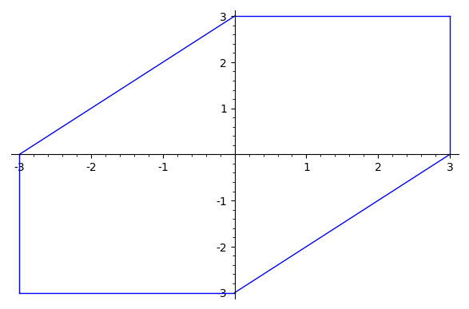

# 二分查找

## 基本性质

二分查找是一个非常实用的算法。它的基本思想是，对于一个在某种意义上有序的数组，这个数组的前半部分满足某一条件，而后半部分不满足这一条件，我们不断选择区间中点，判断其是否满足条件，从而将区间不断折半，最后就可以找到数组中的转折点，也即满足这一条件的最后一个点，或不满足这个条件的第一个点。因为区间的大小每次都缩小为原来的一半，所以二分查找的复杂度是$O(\log N)$。

二分查找在CP中的一个常见应用是**二分答案**。在这一类题目中，我们往往需要求出满足条件的最大值或最小值。如果这一取值和条件的成立与否之间满足有序性，我们就可以通过对整个定义域进行二分查找，来找到我们需要的最值。

## 学习资源

### [ITMO Academy: pilot course](https://codeforces.com/edu/course/2/lesson/6)

来自Codeforces EDU。包括视频教程、图文教程和22道练习题。

## 练习题

### [SPOJ - AGGRCOW](https://www.spoj.com/problems/AGGRCOW/)

::: details 提示

如果把题目变成：要求任意两头牛之间的距离不小于$D$，最多能安排多少头牛，我们应该如何做？

:::

::: details 参考代码（C++）

<<<@/docs/basic/binary-search/src/SPOJ-AGGRCOW.cpp

:::

### [SNSS-2020 R2 - Meeting with readers](https://contest.yandex.com/snss2020/contest/19321/problems/D/)

::: details 提示

如果只选择不满意值不超过$W$的作家，能否覆盖会议所需要的时间段？

:::

::: details 参考代码（C++）

<<< @/docs/editorial/others/SNSS2020-R2/src/d.cpp

:::

### [LC1482 - 制作 m 束花所需的最少天数](https://leetcode-cn.com/problems/minimum-number-of-days-to-make-m-bouquets/)

::: details 提示

在第$k$天，最多能够制作多少束花？

:::

::: details 参考代码（C++）

```cpp
typedef long long ll;

class Solution {
public:
    int minDays(vector<int>& bloomDay, int m, int k) {
        int n = bloomDay.size();
        if (n / k < m)
            return -1;
        int l = 1, r = 1e9;
        auto check = [&](int x) {
            vector<bool> flower(n);
            for (int i = 0; i < n; ++i)
                if (bloomDay[i] <= x)
                    flower[i] = true;
            int bunch = 0, curr = 0;
            for (int i = 0; i < n; ++i) {
                if (flower[i])
                    curr++;
                else {
                    bunch += curr / k;
                    curr = 0;
                }
            }
            bunch += curr / k;
            return bunch;
        };
        while (l <= r) {
            int mid = (l + r) >> 1;
            if (check(mid) < m)
                l = mid + 1;
            else
                r = mid - 1;
        }
        return l;
    }
};
```

:::

### [CF1394C - Boboniu and String](https://codeforces.com/problemset/problem/1394/C)

::: details 提示一

字符串的顺序并不影响所需要的操作次数，起作用的只有`B`和`N`的个数。

:::

:::: details 提示二

尝试在坐标系中画出到点$(x,y)$操作距离为$L$的范围，并用约束条件描述。



::: details 作图代码（Sagemath）

```python
var('x')
g = Graphics()
g += plot(x-3, (x,0,3))
g += plot(x+3, (x,-3,0))
g += plot(3, (x,0,3))
g += plot(-3, (x,-3,0))
g += line([(3,0),(3,3)])
g += line([(-3,-3),(-3,0)])
g.show()
```

:::

::::

::: details 提示三

显然，$L$太小时不存在所有点外包范围的交集，而$L$足够大时一定可以保证所有点的外包范围存在交集。因此可以对$L$进行二分。

:::

::: details 提示四

最后构造答案时，优先取交集范围的右端点，避免出现$(0,0)$这样的不合法的解。

:::

::: details 参考代码（C++）

<<<@/docs/editorial/codeforces/1394/src/c2.cpp

:::

<Utterances />
