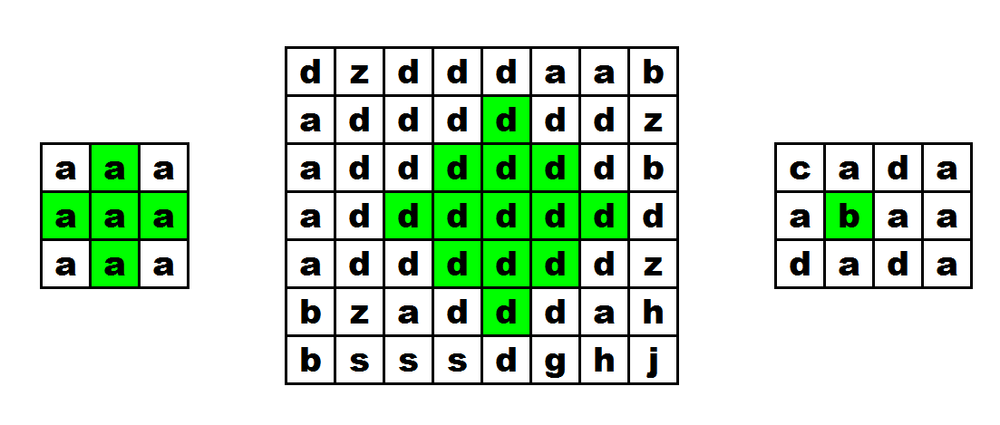

# Codeforces Round 662 (CF1393) 题解

## Problem A - [Rainbow Dash, Fluttershy and Chess Coloring](https://codeforces.com/contest/1393/problem/A)

### 题目描述

两个人如图中所示轮流给棋盘染色，每次只能给当前与有颜色格子相邻的格子染色。问将棋盘染成两种颜色相间所需要的最少染色次数。

### 题解

简单尝试后可以总结出规律，答案为$\left\lceil\frac{n+1}{2}\right\rceil$。

::: details 参考代码（C++）

<<< @/docs/editorial/codeforces/1393/src/a.cpp

:::

## Problem B - [Applejack and Storages](https://codeforces.com/contest/1393/problem/B)

### 题目描述

有若干不同长度的木棍，每次查询会增加一根木棍，或减少一根木棍。要求在每次查询后，回答是否能用当前的木棍组成一个正方形和一个长方形。

### 题解

用一个`set`维护当前每种木棍的数量。对于每次询问，假设当前数量最多的三种木棍依次为$A,B,C$，考虑以下几种组合方式：

- 用$8$个$A$
- 用$6$个$A$，$2$个$B$
- 用$4$个$A$，$4$个$B$
- 用$4$个$A$，$2$个$B$，$2$个$C$

如果这些都不行，说明无法组成。

::: details 参考代码（C++）

<<< @/docs/editorial/codeforces/1393/src/b.cpp

:::

## Problem C - [Pinkie Pie Eats Patty-cakes](https://codeforces.com/contest/1393/problem/C)

### 题目描述

有$n$个数，要求找出一种排列方式，让相同数之间的间隔的最小值最大。求出这个最大的最小值。

### 题解

最优方案是把数量等于最大数量的$k$种数按每种一个捆绑到一起，然后剩下的数在它们中间填空。此时的答案为$\left\lfloor\frac{n-hi\cdot k}{hi-1}\right\rfloor+k-1$，其中$hi$为最大数量。

::: details 参考代码（C++）

<<< @/docs/editorial/codeforces/1393/src/c.cpp

:::

## Problem D - [Rarity and New Dress](https://codeforces.com/contest/1393/problem/D)

### 题目描述

求给定的方阵中，类似图中形状的图案的总数。要求图案内所有字母都相同。

### 题解

分左上、右上、左下、右下四个方向动态规划，最后每个位置处就取对应的四个数的最小值。

::: details 参考代码（C++）

<<< @/docs/editorial/codeforces/1393/src/d.cpp

:::

## Problem E1 - [Twilight and Ancient Scroll (easier version)](https://codeforces.com/contest/1393/problem/E1)

待补做。

## Problem E2 - [Twilight and Ancient Scroll (harder version)](https://codeforces.com/contest/1393/problem/E2)

待补做。
