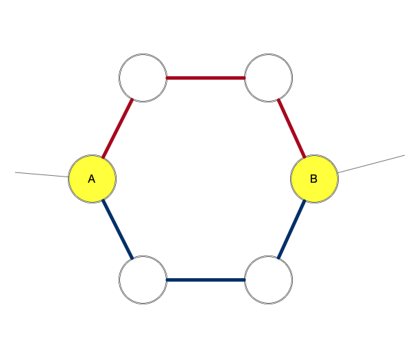

# Facebook Hacker Cup 2020 Round 2 题解

## Problem A - [Ca-pasta-ty](https://www.facebook.com/codingcompetitions/hacker-cup/2020/round-2/problems/A)

### 题目描述

有$N$个区域，每个区域现有$S_i$人，该区域允许的范围为$[L_i,R_i]$，问最少移动多少个人，可以让所有区域的人数都处在允许范围呢？

### 题解

贪心。

记录下超出总人数$overflow$，没有超出上限但可以提供给其他区域的人数$extra$，超过下限但还可以接收来自其他区域的人的总数$vacancy$，还需要的人数$require$。

如果$overflow>=require$，应当优先把$overflow$部分填充到$require$中，再将剩下的填充到$vacancy$中。

否则，先用$overflow$部分去填充$require$，再用$extra$部分填充。

如果最后还有超出的，或者有未被填充的，则说明无解。

::: details 参考代码（C++）

<<<@/docs/tutorial/others/HC2020-R2/src/c.cpp

:::

## Problem B - [Elimination](https://www.facebook.com/codingcompetitions/hacker-cup/2020/round-2/problems/B) 

### 题目描述

有$1,2,\cdots,N$共$N$个选手进行一对一的比赛。编号大的选手一定不弱于编号小的选手。当任意两个选手比赛时，编号大的那个获胜概率为$P$（$0.5\leq P\leq1$）。每次比赛后，输的一方立即被淘汰。求每个选手被淘汰（或最终胜利）时总比赛场数的期望。

### 题解

本题待补。

## Problem C - [Circular Circles](https://www.facebook.com/codingcompetitions/hacker-cup/2020/round-2/problems/C)

### 题目描述

有$N$个小环，每个小环有$M$个节点。相邻两个小环之间有一条边相连。也就是说，一共有$NM+N$条边。初始时所有边的权重都为$1$。

现在进行$E$次修改，每次将第$I_i$条边的权重改为$W_i$。设第$i$次修改后整个图的最小生成树的权值为$V_i$，求$(\prod V_i)\mod1000000007$。

### 题解

本题乍一看有些像[HNOI 2010 - 城市建设](https://blog.csdn.net/u013368721/article/details/39183033?utm_medium=distribute.pc_relevant.none-task-blog-title-1&spm=1001.2101.3001.4242)，但由于本题的图非常特殊，所以并不需要采用那道题里的方法。

考虑这个图的性质。整个图的最小生成树，应当至少包含大环上的$N-1$条边（否则小环会被分成不连通的几组）。那么，对于每个小环，是怎样的情况呢？

不妨考虑下面这个小环。其中$A$和$B$两个顶点是与其他小环相连的。显然，我们可以去掉小环上的一条边，这样整个小环仍然是连通的。我们能否去掉两条边呢？

两个连接点把这个小环分成了两部分。这两部分的边在图中分别用红色和蓝色标记。我们可以发现，如果去掉两条颜色相同的边，一定会产生孤立点。但是如果去掉两条颜色不同的边，则相当于是在大环上断开了一处，此时只要我们在大环上没有其他断点，就不会产生孤立点。

因此，我们就得到了这题最小生成树的两种构造方法：

1. 大环去掉一条边，每个小环去掉一条边
2. 某一个小环去掉两条边，其他每个小环去掉一条边

每一次修改后的最小生成树权值，就对应着这两种方法构造出来的生成树权值的较小值。

对于第一种方法，我们需要维护大环和每个小环的边的大根堆。我们应当舍弃每个环上最大的边。

对于第二种方法，我们需要选择在哪个小环上去掉两条边。这一选取应当基于在这个小环去掉两条边所能减少的权重与去掉一条边所能减少的权重之差。我们需要维护一个权重差的大根堆。另一方面，对于每个小环，我们还需要维护红边和蓝边的两个大根堆，因为我们显然应当选择最大的红边和最大的蓝边。

在每次修改权值后，维护这些堆的信息即可。

::: details 参考代码（C++）

<<<@/docs/tutorial/others/HC2020-R2/src/c.cpp

:::

## Problem D - [Log Drivin' Hirin'](https://www.facebook.com/codingcompetitions/hacker-cup/2020/round-2/problems/D)

本题待补。
